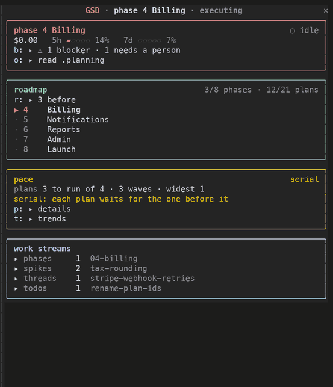
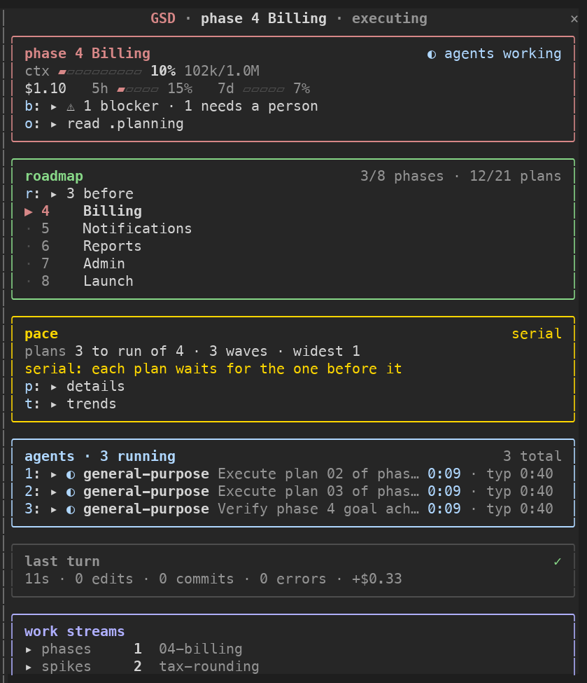
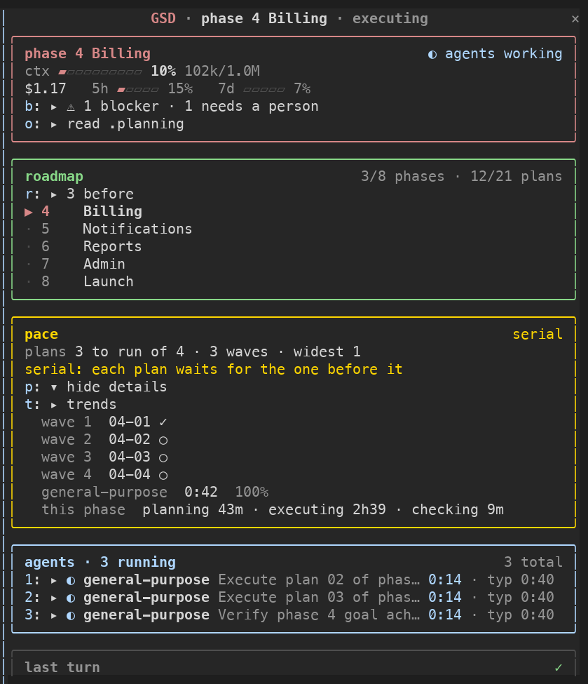
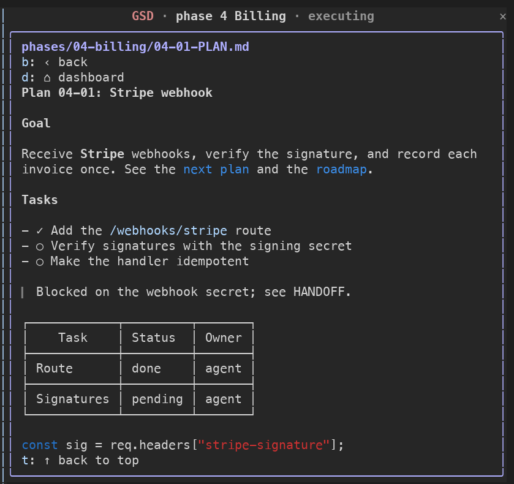
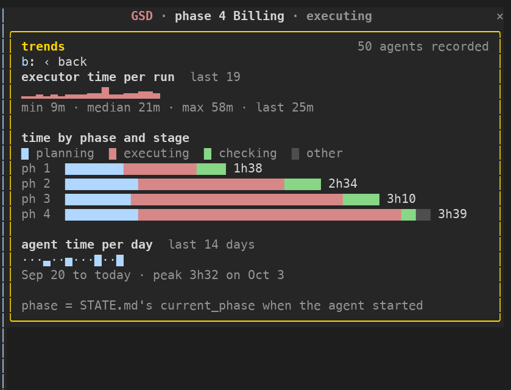
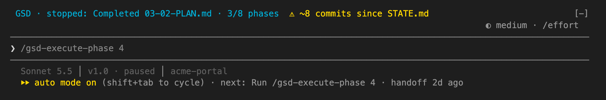
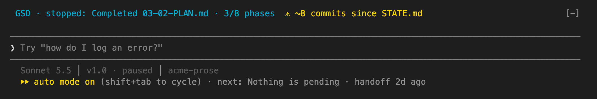
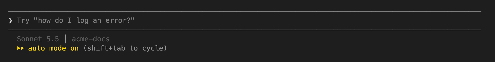

# gsd-status-mod

A live dashboard for [GSD](https://github.com/open-gsd/gsd-core) projects, as a Claude Code mod: the roadmap with the current phase
marked, an agent tree with forks and sub-agents and live clocks, context and cost, work streams, and a built-in markdown
reader for `.planning`. Read-only, no dependencies, and it draws nothing outside a GSD project.

Install (Claude Code 2.1.287 or later):

    claude plugin marketplace add helenkwok/gsd-status-mod
    claude plugin install gsd-status-mod@helenkwok-mods

It is a Claude Code **mod**. It adds a live pane and four smaller things, each showing what the GSD statusline does not:

    GSD · stopped: PAUSED 2026-09-09 after the schema review · 9/14 phases  ⚠ ~124 commits since STATE.md   <- above the prompt
    ❯ /gsd-execute-phase 2                                                                                          <- dim suggestion, Tab to take
    ⏵⏵ auto mode on (shift+tab to cycle) · next: Run /gsd-execute-phase 2 · handoff 5d ago                          <- end of the line under the prompt

- **`GSD ·` line** (above the prompt): shown only for a GSD project (a `.planning/STATE.md` whose frontmatter has
  `gsd_state_version`). `stopped_at` cut to its first sentence, plus phases done. It never repeats `status` or the plan
  counts, which the GSD statusline already shows, and it shows no age: STATE.md's `last_updated` is touched without the
  content changing.
- **`⚠ ~N commits since STATE.md`**: on that line, when the commit in `state_head` is 5 or more commits behind this
  clone's HEAD, so you know STATE.md is stale. Counted from the git reflog, so approximate (it undercounts: 124 against
  217 from `git rev-list` on one repo); hidden when `state_head` is absent or not in the reflog.
- **`next:` hint** (end of the line under the prompt): `next_action` from `.planning/HANDOFF.json`, with the handoff's
  own age. It is added as a dim tail, so the engine's line and its pills stay, and it is hidden while you type or while a
  turn runs. GSD deletes the file after a resume, so it goes away when it is no longer needed.
- **Tab suggestion** (the empty prompt box, once at session start): only when the text shown in the `next:` hint names a
  command. It offers that command, plus a phase number or version if one follows (`/gsd-execute-phase 2`), so it always
  matches the hint beside it. Prose-only actions (`Nothing is pending`) and actions that say to go elsewhere (`Open a
  session in ~/other-project and run ...`) get no suggestion. Tab only fills the box; nothing runs until you press Enter.
  The engine proposes its own suggestion after each turn, so ours shows at session start only.
- **`/gsd-status` command**: the full resume report on demand, read fresh from disk, with no terminal-height limit.
  Phase and status, phase and plan progress, the whole `stopped_at`, the drift warning, and from `HANDOFF.json` the
  next action and its command, blockers, `human_actions_pending` ("Needs a person"), remaining tasks and how many files
  were uncommitted at pause. In a project that is not GSD it says so.

- **Live pane** (docked on the right of a wide terminal, 144+ columns; `/gsd-board` opens or closes it, and the
  `openOnStart` option turns the auto-open off). Bordered boxes that update as events happen, not only per turn:
  - *main*: context gauge, session cost, 5h and 7d limits, blockers and people-needed from the handoff.
  - *roadmap*: the phase checklist from `ROADMAP.md` with the current phase marked. The current phase comes from
    `STATE.md` (its `current_phase`, or the label that starts `current_phase_name`); it is never guessed, so a project
    whose state names no phase shows the list with no marker. Only `- [x] **Phase N: name**` lines are read.
  - *pace*: how the current phase's plans are laid out to run (plans left, waves, the widest wave) and where this
    session's agent time went (share by agent type, and how parallel the executors ran, 1.0 being one at a time). It
    says "serial" only on clear evidence: plans left in single-plan waves, or two or more executors that ran one at a
    time. Plans come from `wave:` in the phase's `*-PLAN.md` frontmatter; a plan with a `NN-MM-SUMMARY.md` is done.
    `p` shows the wave-by-wave list, this phase's time by stage, and the time by type.
    *History:* each finished agent leaves one small record, kept in the plugin's own store across sessions (the last 300
    per project): type, phase, duration, number of model responses, token counts and model. No description, no prompt, no
    text. With five or more past runs of a kind, a running agent's clock shows `typ 0:20` beside it, in amber once it is
    over twice the typical. `t: ▸ trends` opens three charts: executor time per run (a sparkline of the last 30), time by
    phase split into planning, executing and checking, and agent time per day for 14 days, each with its numbers beside it.
    History starts from the day you update; it is per project and never read from transcripts.
  - *agents*: a tree of running and finished agents, with forks (`⑂`) and sub-agents under their parent, and a live
    clock. Finished agents fold away while others run.
  - *markdown reader*: `o: ▸ read .planning` (or any entry under *work streams*) swaps the dashboard for a browser of
    `.planning`, one folder at a time (so any depth), and then for the file itself, drawn by Claude Code's own `Markdown`
    element: the same typography as a reply, at the pane's width, scrolled with the wheel or `PageDown`/`End`. The YAML
    header is hidden, `- [x]` shows as `✓` and `- [ ]` as `○`, and a relative link to another `.md` file under `.planning`
    opens it. `b` goes back one level, and `d: ⌂ dashboard` returns to the dashboard from any depth, and `t: ↑ back to top` ends every file. Only `.planning` is readable.
  - *last turn / turn*, *work streams* (counts and newest of phases, spikes, threads, todos, seeds, notes) and a
    *session log* of prompts, spawns, errors and new commits.

  Everything with a `▸` is clickable. With the pane focused (`ctrl+x`, then `Tab`) hotkeys work too: `1`-`6` agent rows,
  `b` blockers, `r` roadmap, `p` pace, `t` trends, `w` workstream, `o` read `.planning`, `f` finished agents, `l` log. The pane is read-only. The cost is whatever Claude Code
  reports for the session, shown as is; it is an estimate, not a bill. The band above the prompt is hidden while the
  pane is open, so the same line is not drawn twice.

**Workstream mode.** When `.planning/STATE.md` is missing but `.planning/workstreams/<name>/STATE.md` exists, the pane reads
that workstream's `STATE.md`, `ROADMAP.md` and work streams, plus the project-wide folders left at `.planning/` (threads, spikes, seeds...), merged into the same counts (and its `HANDOFF.json`, else the top-level one). GSD's own
choice of active workstream is per session and a mod cannot see it, so the plugin uses the name in
`.planning/active-workstream` if there is one, else the workstream whose `STATE.md` changed most recently. With more than
one, a `w: ⇄ workstream …` button (click, or `w`) switches to the next. The workstream name shows in the header.

Everything follows a `.planning` symlink and draws nothing when there is nothing to show. The band and hint refresh at
session start and after each turn; the pane also refreshes on tool calls and agent events.

The band does not show plan usage (5-hour / weekly limits), since `quota-meter` and `limit-watch` already do; the pane's
main box does show them, for the one-glance view.

## Screenshots

The seven below are from a made-up demo project (`acme-portal`). The four pane images are the pane's own output from a live
Claude Code session with three background agents and a seeded made-up history, drawn to PNG from the terminal text (cropped to the pane); the three
band images are from a terminal at least 16 rows tall.

**The pane.** From the top: the main box (context, cost, limits, blockers), the roadmap with the current phase marked, the
pace box (the plans left, their waves, and a "serial" note when each waits for the one before), the agents with a typical
time beside each running clock (`typ 0:40`, from past runs), the last turn, and the work streams.

**The pane with the pace details opened.** Pressing `p` opened the wave-by-wave plan list, the time by agent type, and this
phase's time by stage. The other `▸` rows open the same way, by click or key.

**The markdown reader.** A phase plan opened from `o: ▸ read .planning`: the YAML header is hidden, tasks show as `✓` and `○`,
and the two blue links are relative links that open the next plan and the roadmap in the same pane.

**The trends view.** Opened with `t: ▸ trends`. The numbers behind it are made up for the demo (38 agents over four phases),
since a fresh demo project has no history: executor time per run, time by phase split into planning, executing and
checking, and agent time per day.

**The band, in the three images below.** The `◐ medium · /effort`
row, the `Sonnet 5.5 │ v1.0 · paused │ acme-portal` statusline and the `auto mode on` text are Claude Code's and the
GSD statusline's own; what this plugin adds is the cyan and yellow line above the prompt, the dim text in the prompt
box, and `· next: … · handoff 2d ago` at the end of the last row.

**A handoff that names a command.** The `GSD ·` line, the drift warning (`~8 commits since STATE.md`), the dim
suggestion in the prompt box (Tab to take it), and the same command in the `next:` hint beside it.

**A handoff that names no command.** The hint still shows the next action, but no suggestion is made, so the prompt box keeps
Claude Code's own `Try "…"` text.

**Not a GSD project.** A `.planning/STATE.md` without `gsd_state_version` is ignored: nothing is added.

## What it can touch (reach)

Read-only, and nothing leaves the machine:

- **Files** (`$.fs.read`, `$.fs.list`, `$.fs.stat`): any `.md` under `.planning/` the reader opens (only when you click it), and `.planning/STATE.md`, `ROADMAP.md`, `HANDOFF.json`, the entry names in `.planning/phases`,
  `spikes`, `threads` and the other work-stream folders, and the git reflog (`.git/logs/HEAD`, or the worktree's git dir
  named in a `.git` file). Paths resolve from the session root (`$.session.root`), not the current folder, so a Bash
  `cd` does not lose the project. In a linked git worktree with no `.planning` of its own, `.planning` is read from the
  main checkout.
- **Session data**: `$.session.usage` (context, cost, limits), `$.agent.list` (the live agents), `$.store` (the history above, in the plugin's own store) and `$.clock.now` /
  `$.clock.every` (a 1-second redraw timer, active only while something runs and the pane is open).
- **UI**: `$.ui.open`, `$.ui.close`, `$.ui.invalidate` and `$.ui.resolve` for the pane and band, `$.command.register` for
  `/gsd-status` and `/gsd-board`, and `$.prompt.suggest` (a dim suggestion in the empty prompt box: it cannot send anything).
- **Hooks it listens to**: `session.start`, `turn.start`, `turn.step`, `turn.complete`, `tool.call` and `agent.spawn` (to count edits and
  errors, count an agent's responses and record how long it ran, and note forks; it never changes or blocks a call), `command.run`, `ui.render` and `ui.close`.

It writes no files, runs no processes and makes no network calls. Check it
yourself: `claude plugin validate .claude-plugin/plugin.json` prints the hooks and the `$` calls the module makes.

## Compatibility with other mods

Tested on Claude Code 2.1.288 with `quota-meter` and `limit-watch` loaded together with this plugin: all three load
without errors and each draws in its own place (they use the pinned status line and a pane; this uses the `AbovePrompt`
band).

The `AbovePrompt` band and the hint line are shared. This plugin keeps whatever other mods draw there: it draws what is
below it in the chain and puts its line on top, and it appends its hint tail after another mod's tail. A mod that answers without calling `next` hides every mod after it in load order; if
such a mod loads before this one, its band is the only one shown, and that is the other mod's behaviour.

## Install it (once)

    claude plugin marketplace add helenkwok/gsd-status-mod
    claude plugin install gsd-status-mod@helenkwok-mods

After that it loads in every session, with no flag. In a project that is not a GSD project it draws nothing. Update with
`claude plugin update gsd-status-mod@helenkwok-mods`; remove with `claude plugin uninstall gsd-status-mod@helenkwok-mods`.
Add `--scope project` to install it for one project only.

## Try it without installing

Needs Claude Code 2.1.287 or later (`claude --version`) and Node 20+ only if you want to run the tests. There is nothing to
build or install: the plugin is loaded from its folder for one session.

    git clone https://github.com/helenkwok/gsd-status-mod ~/gsd-status-mod
    cd <a GSD project>        # it reads .planning from the folder you start claude in (or its main checkout, in a worktree)
    claude --plugin-dir ~/gsd-status-mod

To check the plugin itself: `cd ~/gsd-status-mod`, then `claude plugin validate .` (the marketplace file),
`claude plugin validate .claude-plugin/plugin.json` (the hooks and `$` calls) and `node --test tests/*.test.mjs`.

## Not handled yet

The band above the prompt is not drawn in a very short terminal window: it appeared at 16 rows and above and not at 13 (the
engine drops it). The hint tail and the suggestion are unaffected.

On Windows the pane has been used in a workstream project (it showed the roadmap and workstream); the other features have not been tried there. A session in a worktree shows the main checkout's `.planning`, which is wrong if that worktree is on a different phase. Background:
open-gsd/gsd-core#5174 (a maintainer asked to revisit in-tree support in November 2026; this plugin is the out-of-tree route).
